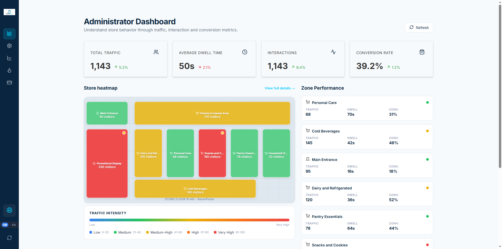
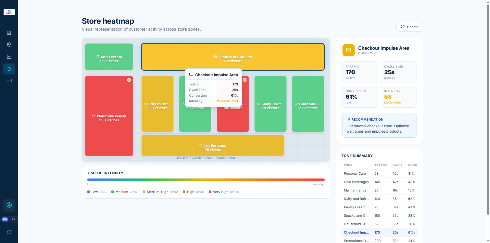
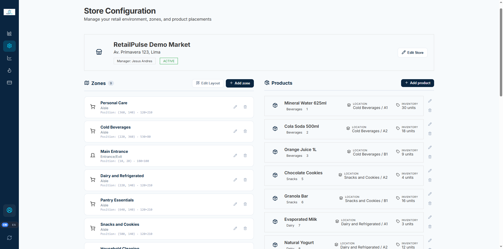
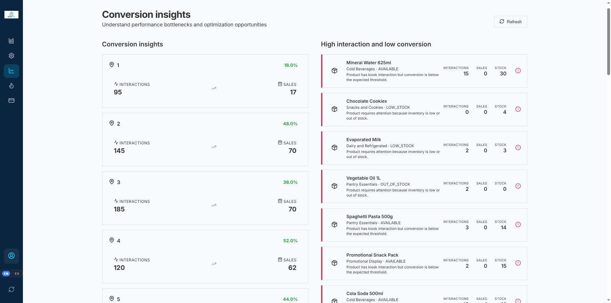
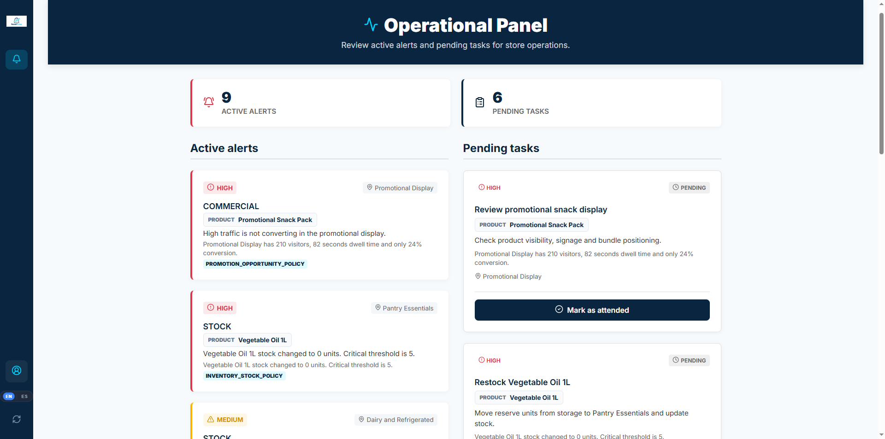
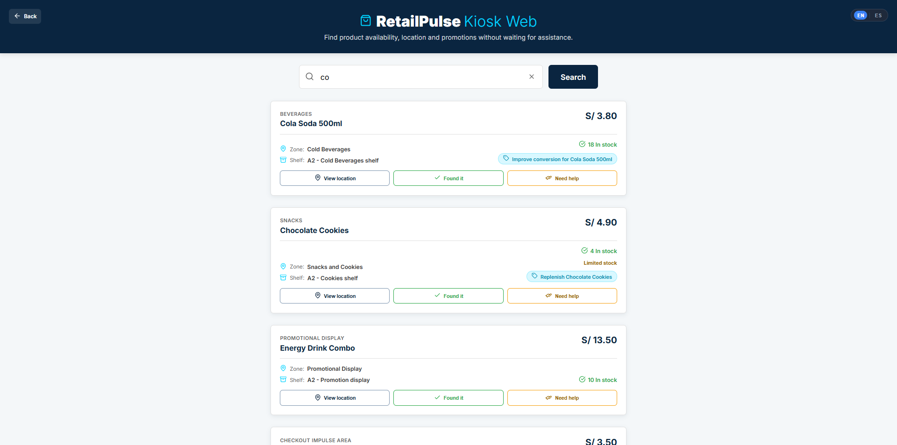
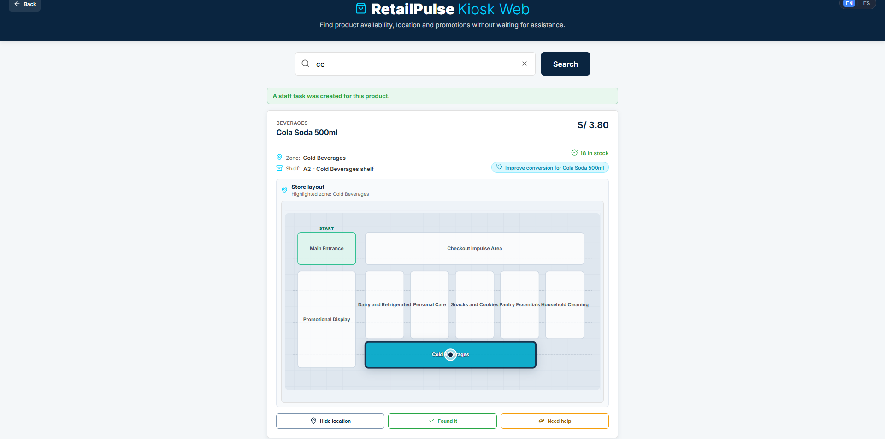
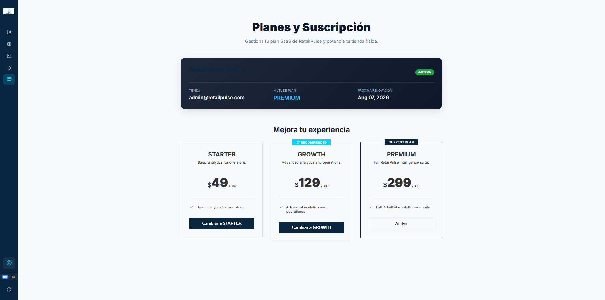

# RetailPulse Web Application

RetailPulse Web Application is the Angular frontend for a retail intelligence and store-operations platform. It brings together shopper traffic, inventory, product placement, operational alerts and promotion opportunities in interfaces designed for three different users:

- Administrators who configure stores and analyze performance.
- Store staff who respond to operational alerts and pending tasks.
- Shoppers who search products through an in-store kiosk and request assistance.

The application is designed around the idea that retail teams should be able to move from **what is happening in the store** to **what action should be taken next**.


## Product overview

RetailPulse connects three operational perspectives in the same frontend:

| Experience | Main purpose | Key screens |
| --- | --- | --- |
| Administrator | Understand store performance and configure the retail environment | Dashboard, store configuration, heatmap, conversion insights, subscriptions |
| Store staff | Respond to issues that require action inside the store | Active alerts, pending tasks, task completion |
| Shopper kiosk | Find products and receive help while shopping | Product search, availability, shelf location, help request |

The current application uses seeded demonstration data to represent a physical store with zones, products, inventory levels, traffic metrics, conversion indicators, recommendations and operational events. Traffic and shopper behavior are simulated for the demo; the backend also exposes endpoints that can receive movement events as an extension point for future integrations.

## Visual tour

The screenshots below are intentionally organized in the order a reviewer can understand the product quickly. Add the files under `docs/screenshots/` using the suggested names, then uncomment each `` tag and remove the placeholder path.

<table>
  <tr>
    <td width="50%">
      <strong>01 · Administrator dashboard</strong><br />
      <sub>Store KPIs, traffic, dwell time, interactions, conversion and zone performance in one view.</sub><br /><br />
      
      <code>docs/screenshots/01-administrator-dashboard.png</code>
    </td>
    <td width="50%">
      <strong>02 · Store heatmap</strong><br />
      <sub>Visual analysis of customer activity, heat levels, congestion and zone-level metrics.</sub><br /><br />
      
      <code>docs/screenshots/02-store-heatmap.png</code>
    </td>
  </tr>
  <tr>
    <td width="50%">
      <strong>03 · Store configuration</strong><br />
      <sub>Management of stores, zones, products, shelf locations and inventory thresholds.</sub><br /><br />
      
      <code>docs/screenshots/03-store-configuration.png</code>
    </td>
    <td width="50%">
      <strong>04 · Conversion insights</strong><br />
      <sub>Conversion gaps, high-interaction products, product performance and actionable recommendations.</sub><br /><br />
      
      <code>docs/screenshots/04-conversion-insights.png</code>
    </td>
  </tr>
  <tr>
    <td width="50%">
      <strong>05 · Staff operations</strong><br />
      <sub>Operational alerts and pending tasks generated by stock, promotion and assistance events.</sub><br /><br />
      
      <code>docs/screenshots/05-staff-operations.png</code>
    </td>
    <td width="50%">
      <strong>06 · Shopper kiosk search</strong><br />
      <sub>Product search experience for in-store kiosks, including availability and promotion information.</sub><br /><br />
      
      <code>docs/screenshots/06-kiosk-search.png</code>
    </td>
  </tr>
  <tr>
    <td width="50%">
      <strong>07 · Product location and assistance</strong><br />
      <sub>Product placement visualization and actions for locating an item or requesting staff help.</sub><br /><br />
      
      <code>docs/screenshots/07-product-location.png</code>
    </td>
    <td width="50%">
      <strong>08 · Subscription management</strong><br />
      <sub>Subscription plans, active account information and plan capabilities that control feature access.</sub><br /><br />
      
      <code>docs/screenshots/08-subscription-management.png</code>
    </td>
  </tr>
</table>

## Main capabilities

### Administrator dashboard

- Total traffic, average dwell time, interactions and conversion rate.
- Zone performance cards with traffic, dwell and conversion details.
- Interactive store heatmap with selected-zone state.
- Refreshable data loading states and visible error handling.
- Direct navigation to detailed heatmap and conversion views.

### Store configuration

- Store profile and manager information.
- Zone creation, editing, deletion and layout positioning.
- Product catalog management with SKU, category, price, status and placement.
- Inventory creation and stock updates.
- Critical stock thresholds and status calculation.
- Upsert flow for zone traffic metrics.

### Traffic analytics

- Heatmap metrics by zone.
- Traffic, dwell time, interactions and conversion rates.
- Heat-level and congestion indicators.
- Zone detail panel and summary table.
- Reusable heatmap, KPI card, legend and zone tooltip components.

### Promotion and conversion optimization

- Conversion-gap cards.
- Identification of products with high interaction but low conversion.
- Top-performing product cards.
- Promotion recommendations with active/applied state.
- Recommendation application flow that triggers an API update.

### Store operations

- Active operational alerts.
- Pending operational tasks.
- Severity, priority, source and affected product/zone context.
- Staff action to attend or complete a task.
- Error, loading and empty states for operational workflows.

### Assisted shopping kiosk

- Search products by query.
- Display price, stock, promotion and placement information.
- View the product location inside the store.
- Register shopper actions such as search, found and location viewed.
- Request help from store staff for a specific product.
- Start and maintain a kiosk session.

### Subscription and capability access

- Display available subscription plans.
- Display the current SaaS account and active plan.
- Change the active subscription plan.
- Guard administrator features such as heatmap and conversion insights according to plan capabilities.

## Frontend architecture

The codebase is organized by business context rather than by a single global collection of components. Each context separates domain models, application state, infrastructure services and presentation components where appropriate.

### Feature contexts

```text
src/app/
├── assisted-shopping/       # Kiosk search, sessions and shopper actions
├── inventory-intelligence/  # Inventory API integration and stock models
├── platform/                # Store setup, subscription and capability guards
├── promotion-optimization/  # Conversion insights and recommendations
├── shared/                  # Layout, HTTP infrastructure, localization and shared models
├── store-operations/        # Alerts, tasks and operational workflows
└── traffic-analytics/       # Dashboard, heatmap and traffic metrics
```

The application uses standalone Angular components, Angular Router, Signals, RxJS services, HTTP interceptors, domain entities, value objects, response assemblers and reusable presentation components.

## API integration

The frontend communicates with the backend through a base URL defined by the Angular environment files:

| Environment | API base URL |
| --- | --- |
| Development | `http://localhost:8080/api/v1` |
| Production | Configured in `src/environments/environment.prod.ts` |

The `ownerContextInterceptor` adds the `X-Owner-Email` header to API requests when a demo user is present in `localStorage`. This allows the backend to resolve the current SaaS account and scope store data for the active owner.

Representative integrations include:

| Frontend context | API resources |
| --- | --- |
| Traffic analytics | `/traffic/heatmap`, `/traffic/zones/metrics`, `/traffic/congestion`, `/zones` |
| Store setup | `/stores`, `/zones`, `/products`, `/inventory/items`, `/traffic/zones/{zoneId}/metrics` |
| Store operations | `/operational-alerts`, `/operational-tasks` |
| Assisted shopping | `/kiosk/products/search`, `/kiosk/sessions` |
| Promotion optimization | `/promotion-recommendations`, `/promotion-recommendations/product-opportunities` |
| Subscription | `/subscription/plans`, `/subscription/accounts` |

## Demo access

The current frontend includes a client-side demo access layer for navigating the administrator and staff experiences:

| Role | Email | Password |
| --- | --- | --- |
| Administrator | `admin@retailpulse.com` | `admin` |
| Store staff | `staff@retailpulse.com` | `staff` |

This login is intended for the demo frontend flow. It stores the selected role, user and plan in `localStorage`; it is not a replacement for production authentication and authorization.

## Getting started

### Prerequisites

- Node.js version supported by Angular 21.
- npm 11 or a compatible npm version.
- The RetailPulse Web Services repository running on port `8080` for the full-stack flow.

### Install dependencies

```bash
npm install
```

### Run the frontend with the backend

Start the Spring Boot API first, then run the Angular development server:

```bash
npm start
```

The application is available at:

```text
http://localhost:4200
```

### Run with the local JSON Server mock

The repository also contains a lightweight JSON Server dataset under `server/db.json` for isolated frontend demonstrations.

Terminal 1:

```bash
npm run start:api
```

This starts JSON Server at `http://localhost:3000`. To use it from the Angular application, point the development environment API URL temporarily to:

```text
http://localhost:3000/api/v1
```

Then start Angular in a second terminal:

```bash
npm start
```

The mock dataset includes products, stores, zones, traffic metrics, conversion metrics, recommendations, subscription data, alerts and operational tasks.

### Build

```bash
npm run build
```

### Tests

```bash
npm test
```

The project includes Angular unit-test scaffolding for the application shell, login, registration, staff alerts and dashboard-related components.

## Internationalization

The interface supports English and Spanish through `@ngx-translate/core`. Translation files are located at:

```text
public/i18n/en.json
public/i18n/es.json
```

The application selects a supported browser language automatically and falls back to English.

## Repository structure

```text
.
├── public/                 # Logo, favicon and translation files
├── server/                 # JSON Server mock API and demo dataset
├── src/
│   ├── app/                # Feature contexts and shared application code
│   ├── environments/       # Development and production API configuration
│   ├── main.ts             # Browser bootstrap
│   ├── main.server.ts      # SSR bootstrap
│   └── server.ts           # Angular SSR server entry point
├── angular.json
├── package.json
└── tsconfig*.json
```

## Current scope

The frontend currently demonstrates the application experience and domain workflows with seeded or simulated data. It does not include a production identity provider, real IoT/sensor ingestion, payment processing implementation or a complete production authorization model. Those concerns are represented by the backend contracts, subscription capabilities and integration points used by the application.
